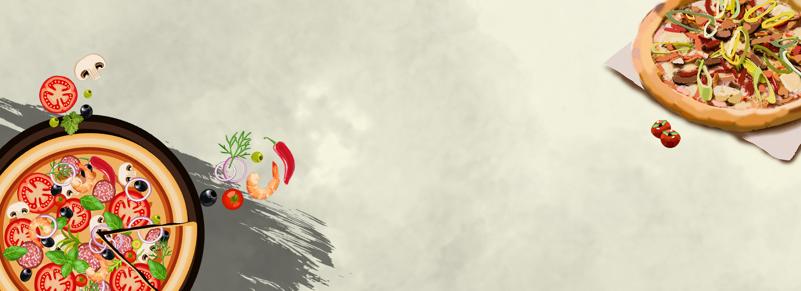
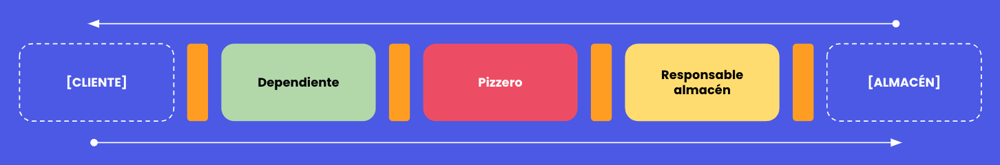

[](https://img.shields.io/badge/android-bootcamp-orange?style=flat-square)

# IOS bootcamp - Restaurante de pizza
---
## ✍️ Acerca de

Este entrenamiento esta preparado para que practiques tu capacidad de trabajo en equipo y tu compresión
de los protocolos.

En este caso vamos a trabajar en un restaurante de pizza (**Francesco's pizza**) tenéis que dividiros en grupos de 3 y cada uno
de vosotr@s tendréis que desempeñar un rol distinto.

- Dependiente
- Cocinero
- Asistente de cocina / encargado del almacen



## Roles
Cada rol tiene una misión única y es absolutamente necesario para poder hacer funcionar el restaurante. 

### 🧑‍💼 Dependient@
Tu misión es recibir los pedidos del cliente para darselos al cocinero y gestionar cualquier problema que este pueda tener.
Además al finalizar deberás calcular el importe del pedido y cobrar al cliente.

Interactuas con el cocinero a través de:

```swift
enum FoodStatus {
    case done
    case missingIngredients
}

protocol CookerProtocol {
    func cook(this pizza: Pizza) -> FoodStatus
}
```

### 🧑‍🍳‍ Cociner@
Tu misión es cocinar todos los productos para ello necesitas ingredientes que tendrá que proporcionarte el asistente de cocins.
Para cocinar necesitas restar a los ingredientes de la pizza los ingredientes obtenidos del encargado del almacen. Recuerda avisar al dependiente si no puedes cocinar la pizza del cliente.

Interactuas con el asistente de cocina a través de:

```swift
protocol KitchenAssistantProtocol {
    func checkWithdrawAndReturn(this ingredient: Ingredient) -> Ingredient?
}
```

### 👷 Asistente de cocina
Tu misión es obtener y manejar el stock del almacen. Los ingredientes no son infinitos recuerdalo. Tu almacen funciona así:

```swift
enum WareHouseError: Error {
    case notFound
    case notEnough
}

protocol WareHouseProtocol {
    func getIngredient(name: String) throws -> Ingredient
    func withdraw(ingredient: Ingredient) throws
}
```

## 🎯 Objetivos
Para llevar a buen cabo este entrenamiento deberás de:
- Desarrollar tecnicamente tu rol
- Entender que las cosas no siempre van bien, es decir, no solo existe el "happy path"
- Trabaja en equipo encuentra la forma de que tu restaurante funcione

---


**Develop by rudo apps**

hola@rudo.es | https://www.rudo.es
